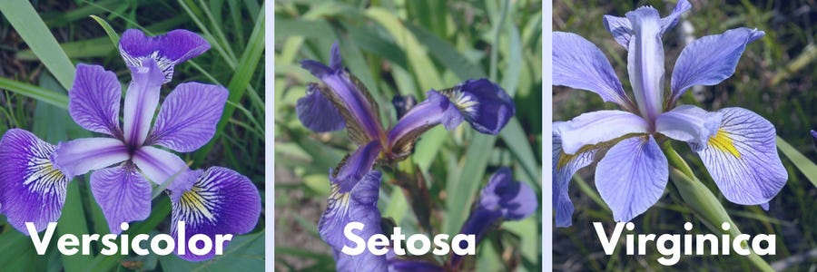

# Iris Classification

### Problem Statement

The goal of this project is to predict and classify the species (setosa, versicolor, virginica) with 4 features: sepal length, sepal width, petal length, petal width, using machine learning models.

### Preview of Data

Create the iris dataset with sklearn the inbuilt datasets. 
There are 150 observations, 4 attributes (sepal length, sepal width, petal length, petal width). 
There are 50 observations of each 3 species (setosa, versicolor, virginica). 
There are no null values. 

### Model

1. Divide the data into training and test sets, standardising the data.
2. Build, train the model and make predictions with Logistic Regression and KNeighbors Classifier.

### Output
Logistic Regression: 93% of observations were classified correctly.  
KNeighborsClassifier: 95% of observations were classified correctly.  
